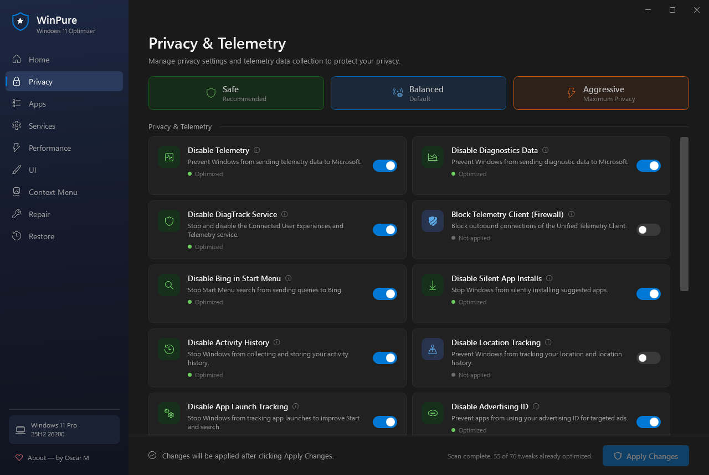
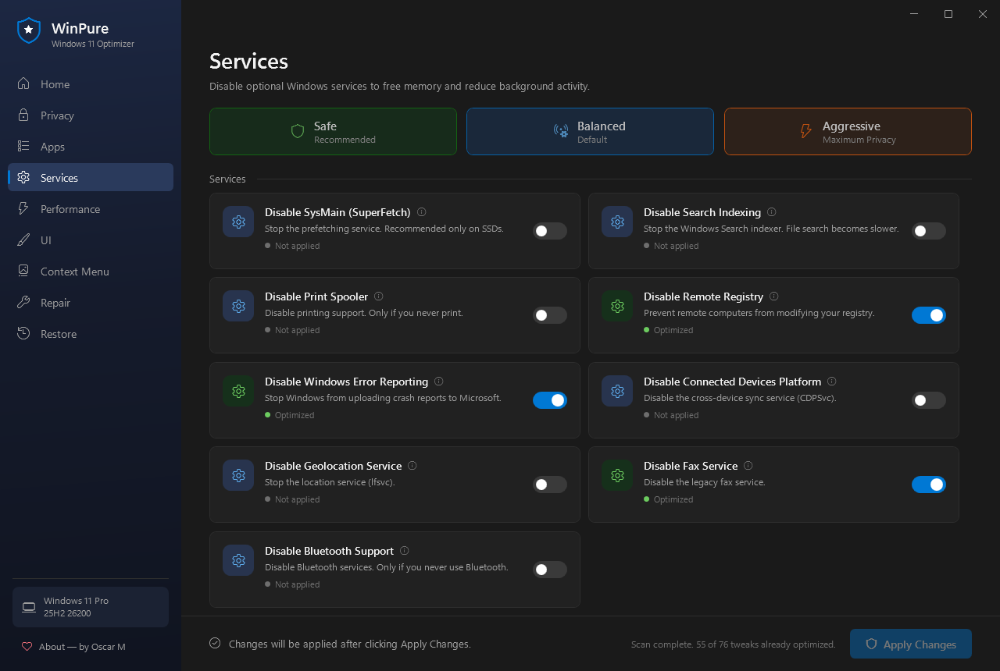
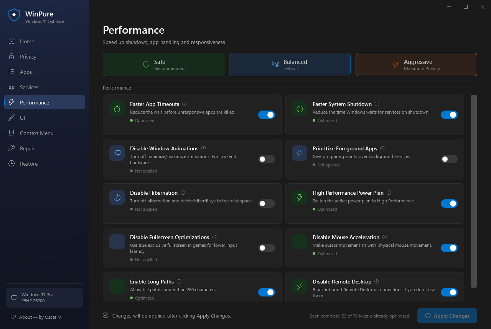
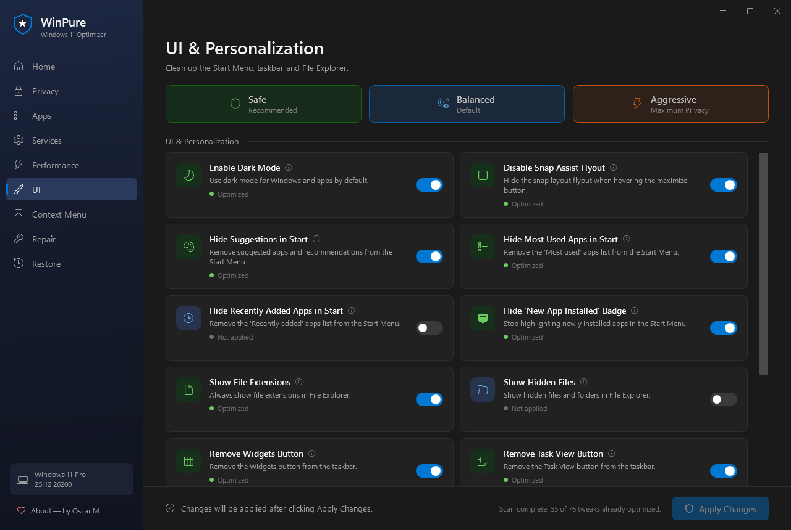
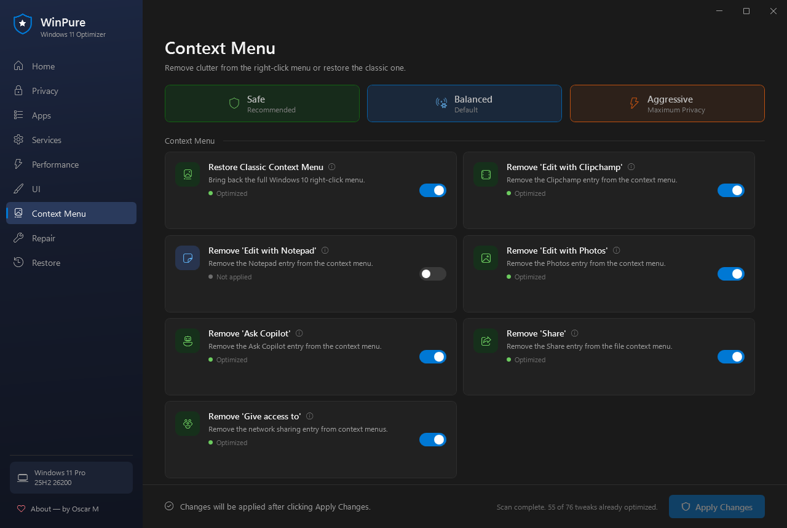
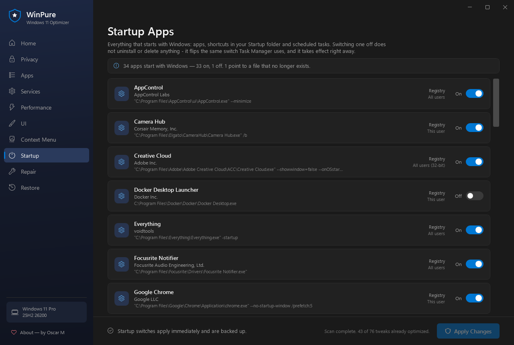
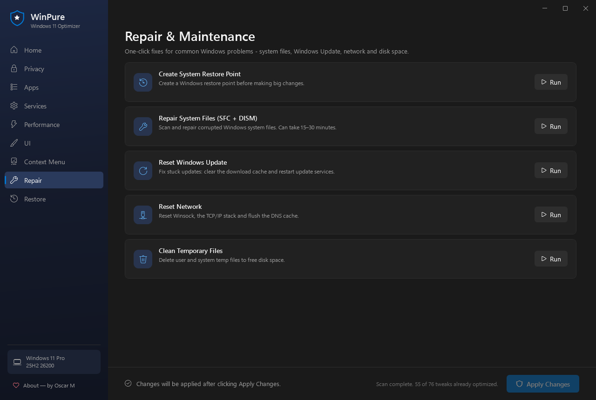
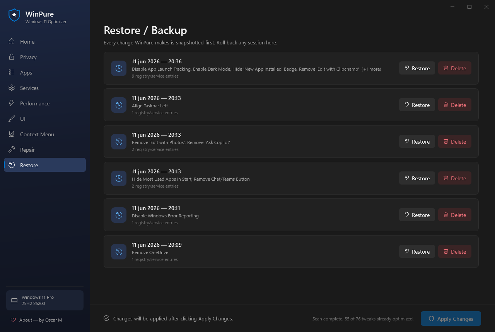
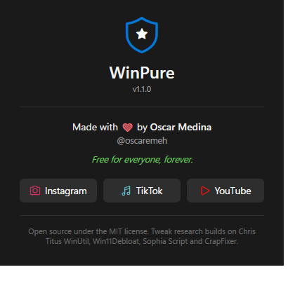

<div align="center">


# WinPure

**A modern, safe, open-source Windows 11 debloater and optimizer.**

*Made with ❤ by [Oscar Medina](https://www.youtube.com/@oscar_emeh) (@oscaremeh) — free for everyone, forever.*

[](https://github.com/oscarmm91/winpure/releases/latest)
[](https://github.com/oscarmm91/winpure/releases)
[](https://github.com/oscarmm91/winpure/actions)
[](LICENSE)
[](#requirements)



</div>

---

## Why WinPure?

- 🛡 **It never breaks your system.** Every registry value, service and scheduled task is snapshotted **before** it is touched. One click in the *Restore* page rolls anything back — except app removals, which live on their own page and ask first.
- ⚡ **One-click presets** — *Safe*, *Balanced* and *Aggressive* — or full manual control, tweak by tweak. Mix both freely.
- 🔍 **Honest state detection.** On launch WinPure scans your system and shows what is *already optimized* vs *not applied*. No fake "boost" buttons.
- 🔎 **Search every tweak** from the sidebar, and see at a glance how many changes each category has waiting.
- 🌎 **English and Spanish.** WinPure follows your Windows display language.
- 📤 **Export / import your configuration** — tick the same tweaks on another PC from one small file. Importing only ticks boxes; nothing changes until you click Apply.
- 🧰 **Repair toolbox built in** — SFC + DISM, Windows Update reset, network reset, restore points and temp cleanup.
- 📴 **100 % offline & portable.** A single .exe — no installer, no .NET needed, no telemetry of its own, runs from a USB stick.
- 🆓 **MIT licensed.** Free for everyone, forever.

## Download

1. Download **`WinPure.exe`** from the [latest release](https://github.com/oscarmm91/winpure/releases/latest).
2. Run it — Windows asks for administrator permission (needed for HKLM, services and scheduled tasks).
3. Pick a preset or flip individual toggles → **Apply Changes**. A backup is created automatically first.

> 📁 Backups: `%ProgramData%\WinPure\Backups\` (only administrators can write there) · Logs: `%AppData%\WinPure\Logs\`

## Presets

| Preset | What it includes | Risk |
|---|---|---|
| 🟢 **Safe** | Basic telemetry off, no Bing/ads in Start, advertising ID off, cleaner context menu, dark mode, taskbar cleanup | None |
| 🔵 **Balanced** | Safe + optional services off, Click to Do off, Delivery Optimization off, faster shutdown | Low |
| 🟠 **Aggressive** | Balanced + Copilot/AI & Recall off, DiagTrack disabled, telemetry firewall block, telemetry tasks off | Power users |

No preset removes an app, so everything a preset does can be switched back off. Uninstalling apps has its own page, **Remove Apps**, where you tick each one yourself.

Selecting a preset only marks the toggles — **nothing changes until you click Apply Changes**.

## What it can do

> 📚 Full tweak reference with registry details: [docs/tweaks.md](docs/tweaks.md)

<details>
<summary>🔒 <b>Privacy & Telemetry</b> — 21 tweaks</summary>
<br/>
Telemetry (AllowTelemetry → 0), diagnostics data, DiagTrack service, outbound telemetry firewall block, Bing in Start Menu, silent app installs, Consumer Features, Delivery Optimization, background apps, Activity History, location tracking, app-launch tracking, Advertising ID, Windows Feedback, online speech recognition, inking/typing personalization, Compatibility-Appraiser & CEIP scheduled tasks, search history, the language list websites can read, diagnostic data tasks.
<br/><br/>

</details>

<details>
<summary>📦 <b>Apps & AI</b> — 6 tweaks</summary>
<br/>
Copilot, Windows AI & Recall, Click to Do, Paint's AI features, Game Bar capture, Game Bar integration (and its ms-gamebar popup) — switched off without uninstalling anything.
</details>

<details>
<summary>⚙️ <b>Services</b> — 9 tweaks</summary>
<br/>
SysMain (SuperFetch), Windows Search indexing, Print Spooler, Remote Registry, Error Reporting, Connected Devices Platform, Geolocation, Fax, Bluetooth — each disabled service is snapshotted with its original start mode.
<br/><br/>

</details>

<details>
<summary>🚀 <b>Performance</b> — 15 tweaks</summary>
<br/>
Faster app timeouts & shutdown, foreground-app priority, window animations, hibernation, High Performance power plan, fullscreen optimizations, mouse acceleration, long paths, Remote Desktop, Fast Startup, early optional updates, daily registry backup, NTP time server, Reserved Storage.
<br/><br/>

</details>

<details>
<summary>🎨 <b>UI & Personalization</b> — 19 tweaks</summary>
<br/>
Dark mode, Snap Assist flyout, Start Menu suggestions/most-used/recently-added, "new app" badge, file extensions, hidden files, Widgets/Task View/Chat taskbar buttons, taskbar alignment, End Task on right-click, Aero Shake, search highlights, NumLock at sign-in, Spotlight wallpaper, "What's new" screens after updates, the F1 help key.
<br/><br/>

</details>

<details>
<summary>🖱️ <b>Context Menu</b> — 8 tweaks</summary>
<br/>
Restore the classic Windows 10 right-click menu, remove "Edit with Clipchamp / Notepad / Photos", "Ask Copilot", "Share" and "Give access to", and lift the 15-file limit on right-click options.
<br/><br/>

</details>

<details>
<summary>🧩 <b>Windows Features</b> — 8 tweaks</summary>
<br/>
Turn off PowerShell 2.0, SMB 1.0, the XPS Document Writer, Windows Media Player Legacy and Work Folders — or turn on Windows Sandbox, WSL and .NET Framework 3.5. Undo puts back the state each feature had.
</details>

<details>
<summary>🌐 <b>Microsoft Edge</b> — 7 tweaks</summary>
<br/>
Edge's new tab page without news, trending searches, default tiles or the Microsoft 365 launcher; no feature tips, Acrobat upsell, default-browser prompts, shopping assistant or Rewards. These are Edge policies, so Edge says it is managed by your organization while any of them is on. All Manual, never in a preset.
</details>

<details>
<summary>🗑️ <b>Remove Apps</b> — 18 tweaks</summary>
<br/>
Candy Crush, TikTok/Facebook/X/Instagram, Netflix/Disney+/Prime/Spotify, Skype, Clipchamp, Paint 3D & 3D Viewer, To Do, Groove/Movies & TV, Solitaire, Wallet, Whiteboard, Phone Link, Dev Home, Get Help & Tips, Xbox suite + Game DVR, preinstalled casual games (Asphalt, FarmVille, Royal Revolt…), AI Hub, OneDrive. The page of tweaks WinPure cannot undo: no preset ticks anything here, an import never ticks a removal, and removing asks once more before it runs.
</details>

<details>
<summary>📥 <b>Install Apps</b> — 23 apps with winget</summary>
<br/>
Browsers, 7-Zip, Everything, PowerToys, ShareX, Notepad++, password managers, VLC, OBS, Git, VS Code, Python, Node.js, Discord, Zoom, LibreOffice, Acrobat Reader, Steam and Epic — installed from their publishers with winget. Like an app removal, an install is something WinPure cannot undo, so it lives on its own page, in no preset, and asks before every install.
</details>

<details>
<summary>🚦 <b>Startup Apps</b> — everything that starts with Windows</summary>
<br/>
Apps launched from the registry (per-user, machine-wide and 32-bit), shortcuts in both Startup folders, and third-party scheduled tasks that run at logon — in one list, with the publisher and the real command line. Switching one off <b>uninstalls nothing</b>: it flips the same switch Task Manager uses, so the two always agree, and the change is backed up like everything else. Entries whose file no longer exists are flagged.
<br/><br/>

</details>

<details>
<summary>🔧 <b>Repair & Maintenance</b> — 5 tools</summary>
<br/>
Create a system restore point, repair system files (SFC + DISM), reset Windows Update components, reset the network stack, clean temporary files.
<br/><br/>

</details>

<details>
<summary>♻️ <b>Restore / Backup</b> — undo any tweak</summary>
<br/>
Every Apply creates a JSON snapshot of the exact registry values, service start modes and task states that are about to change. Restore any session — or a single one — at any time.
<br/><br/>

</details>

<details>
<summary>ℹ️ <b>About</b></summary>
<br/>

</details>

## FAQ

**Is it safe?**
Yes. WinPure only uses documented registry policies and standard Windows commands, never patches system files, and snapshots everything before changing it. No preset removes an app, so every preset is fully reversible by design.

**Something broke / I changed my mind. How do I undo?**
Open **Restore**, pick the snapshot from when you applied the change, click *Restore*. App removals and app installs are the exceptions — reinstall a removed app from the Microsoft Store (OneDrive from microsoft.com), and uninstall an installed one from Settings > Apps.

**Why does it need administrator rights?**
Most tweaks live in `HKEY_LOCAL_MACHINE`, services and scheduled tasks — all of which require elevation. WinPure asks via the standard UAC prompt.

**Does WinPure phone home?**
No. Zero network calls except the ones *you* trigger (e.g. the telemetry firewall rule it *blocks*). No analytics, no auto-update.

**Windows 10?**
Windows 11 is the target; most tweaks also work on Windows 10 22H2+, but it is not actively tested there.

## Requirements

- Windows 11 (Windows 10 22H2+ mostly compatible)
- Administrator account
- Nothing else — the exe is self-contained

## Building from source

```powershell
# requires .NET 8 SDK
dotnet build WinPure.sln                                  # debug build
dotnet run --project tests/WinPure.EngineTests            # backup / revert engine tests
dotnet publish src/WinPure/WinPure.csproj -c Release      # portable single-file exe
```

Stack: WPF (.NET 8) · C# · MVVM · zero NuGet dependencies. Tweaks are plain data in [`TweakCatalog.cs`](src/WinPure/Services/TweakCatalog.cs) — adding one is a ~10-line PR.

## Author


Made with ❤ by **Oscar Medina** — *@oscaremeh*

- 📷 [Instagram](https://www.instagram.com/oscar.emeh/)
- 🎵 [TikTok](https://www.tiktok.com/@oscar.emeh)
- ▶️ [YouTube](https://www.youtube.com/@oscar_emeh)

*Free for everyone, forever.*

<br clear="right"/>

## Credits

Tweak research builds on the excellent work of
[Chris Titus WinUtil](https://github.com/ChrisTitusTech/winutil),
[Win11Debloat](https://github.com/Raphire/Win11Debloat),
[Sophia Script](https://github.com/farag2/Sophia-Script-for-Windows),
[CrapFixer](https://github.com/builtbybel/Crapfixer) and
[Win-Debloat-Tools](https://github.com/LeDragoX/Win-Debloat-Tools).

## License

[MIT](LICENSE)
